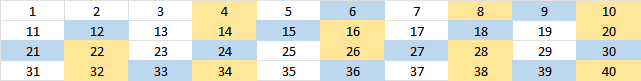
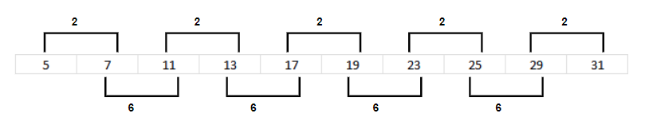

# Check for Prime

## Problem

Given a number n, check if the number is prime.

## Tips

Divisors always occur in pairs.

## Solution

### [Prime.java](../../src/main/java/com/math/Prime.java)

### Method 1 - Naive

Check if the number is divisible by any number less than n itself.

```java
  private static boolean isPrime_naive(final int n) {
    for (int i = 2; i < n; i++) {
      if (n % i == 0) {
        return false;
      }
    }
    return true;
  }
```

| Time Complexity | Auxiliary Space Complexity |
|:---------------:|:--------------------------:|
|      O(n)       |            O(1)            |

### Method 2 - Efficient

Since divisors occurs in pairs, it is enough to check till square root of n instead of n.
Because for any number to occur beyond that must have smaller divisor which must be present
before square root of n.

```java
  private static boolean isPrime_efficient(final int n) {
    for (int i = 2; i * i < n; i++) {
      if (n % i == 0) {
        return false;
      }
    }
    return true;
  }
```

| Time Complexity | Auxiliary Space Complexity |
|:---------------:|:--------------------------:|
|   O(sqrt(n))    |            O(1)            |

### Method 3 - More Efficient

Upon noticing the number series, one could observe the majority of numbers are divisible by 2 or 
3 which eliminate a large amount of traversal and check. Once we have eliminated the numbers 
divisible by 2 and 3, below patter emerges, and it is enough to check after 2nd and 6th position 
starting with 5.





```java
  private static boolean isPrime_ultraEfficient(final int n) {

    if (n <= 1) {
      return false;
    }

    // Check if n=2 or n=3
    if (n == 2 || n == 3) {
      return true;
    }

    // Check whether n is divisible by 2 or 3
    if (n % 2 == 0 || n % 3 == 0) {
      return false;
    }

    // Check from 5 to square root of n
    // Iterate i by (i+6)
    for (int i = 5; i <= Math.sqrt(n); i = i + 6) {
      if (n % i == 0 || n % (i + 2) == 0) {
        return false;
      }
    }

    return true;
  }
```

| Time Complexity | Auxiliary Space Complexity |
|:---------------:|:--------------------------:|
|   O(sqrt(n))    |            O(1)            |

___

* [Math - Home](math.md)
* [DS Algo Home](../../README.md)