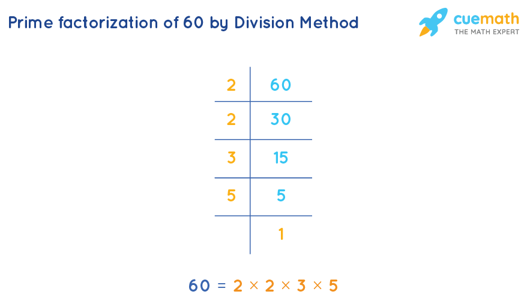

# Prime Factors

## Problem

Prime factorization is a way of expressing a number as a product of its prime factors. A prime
number is a number that has exactly two factors, 1 and the number itself. For example, if we take
the number 30. We know that 30 = 5 × 6, but 6 is not a prime number. The number 6 can further be
factorized as 2 × 3, where 2 and 3 are prime numbers. Therefore, the prime factorization of 30 = 2 ×
3 × 5, where all the factors are prime numbers.



## Solution

### [PrimeFactors.java](../../src/main/java/com/math/PrimeFactors.java)

### Method 1
```java
  public static String primeFactors_division(int n) {
    System.out.print(n + " - ");
    StringBuilder builder = new StringBuilder();
    for (int i = 2; i * i <= n; i++) {
      while (n % i == 0) {
        builder.append(i).append(" ");
        n = n / i;
      }
    }
    if (n > 2) {
      builder.append(n);
    }
    String factors = builder.toString().trim();
    System.out.println(factors);
    return factors;
  }
```
| Time Complexity  | Auxiliary Space Complexity |
|:----------------:|:--------------------------:|
| O(√nlog(n)) |            O(1)            |

### Method 2 - Efficient
```java
public static String primeFactors_division_efficient(int n) {
    System.out.print(n + " - ");
    StringBuilder builder = new StringBuilder();

    while (n % 2 == 0) {
      builder.append(2).append(" ");
      n = n / 2;
    }

    while (n % 3 == 0) {
      builder.append(3).append(" ");
      n = n / 3;
    }

    for (int i = 5; i * i <= n; i = i + 6) {
      while (n % i == 0) {
        builder.append(i).append(" ");
        n = n / i;
      }
      int iP2 = i + 2;
      while (n % iP2 == 0) {
        builder.append(iP2).append(" ");
        n = n / iP2;
      }
    }
    if (n > 2) {
      builder.append(n);
    }
    String factors = builder.toString().trim();
    System.out.println(factors);
    return factors;
  }
```
| Time Complexity  | Auxiliary Space Complexity |
|:----------------:|:--------------------------:|
| O(√nlog(n)) |            O(1)            |


___

* [Math - Home](math.md)
* [DS Algo Home](../../README.md)