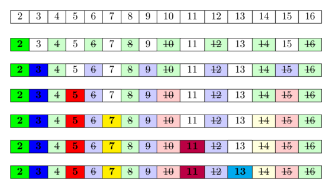

# Sieve of Eratosthenes

## Problem

Given a number n, print all primes smaller than or equal to n. It is also given that n is a small
number.

## Tips

In mathematics, the sieve of Eratosthenes is an ancient algorithm for finding all prime numbers up
to any given limit.

Sieve of Eratosthenes is an algorithm for finding all the prime numbers in a segment [1;n] using
O(n*loglog(n)) operations.

The algorithm is very simple: at the beginning we write down all numbers between 2 and **n** . We mark
all proper multiples of 2 (since 2 is the smallest prime number) as composite. A proper multiple of
a number x , is a number greater than x and divisible by x . Then we find the next number that
hasn't been marked as composite, in this case it is 3. Which means 3 is prime, and we mark all
proper multiples of 3 as composite. The next unmarked number is 5, which is the next prime number,
and we mark all proper multiples of it. And we continue this procedure until we processed all
numbers in the row.

In the following image you can see a visualization of the algorithm for computing all prime numbers
in the range [1; 16] . It can be seen, that quite often we mark numbers as composite multiple
times.



Sieve of Eratosthenes
The idea behind is this: A number is prime, if none of the smaller prime numbers divides it. Since
we iterate over the prime numbers in order, we already marked all numbers, who are divisible by at
least one of the prime numbers, as divisible. Hence if we reach a cell and it is not marked, then it
isn't divisible by any smaller prime number and therefore has to be prime.

## Solution

```java
  private static String getPrimes(final int number) {
    boolean[] isPrime = new boolean[number + 1];
    Arrays.fill(isPrime, true);

    for (int i = 2; i * i <= number; i++) {
      if (isPrime[i]) {
        for (int j = 2 * i; j <= number; j = j + i) {
          if (j % i == 0) {
            isPrime[j] = false;
          }
        }
      }
    }
    StringBuilder builder = new StringBuilder();
    for (int i = 2; i < isPrime.length; i++) {
      if (isPrime[i]) {
        System.out.print(i + " ");
        builder.append(i).append(",");
      }
    }
    String primes = builder.toString();
    return primes.substring(0, primes.length() - 1);
  }
```

|   Time Complexity   | Auxiliary Space Complexity |
|:-------------------:|:--------------------------:|
|      O(n*loglog(n)) |            θ(n)            |
___

* [Math - Home](math.md)
* [DS Algo Home](../../README.md)